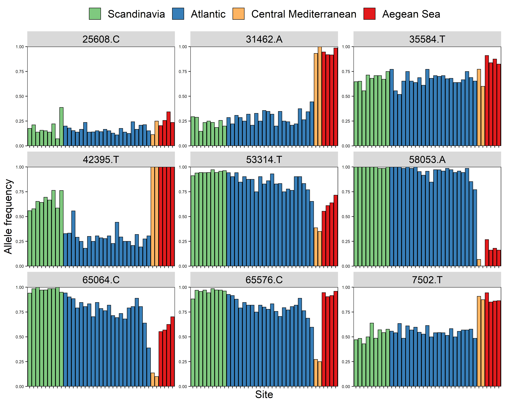
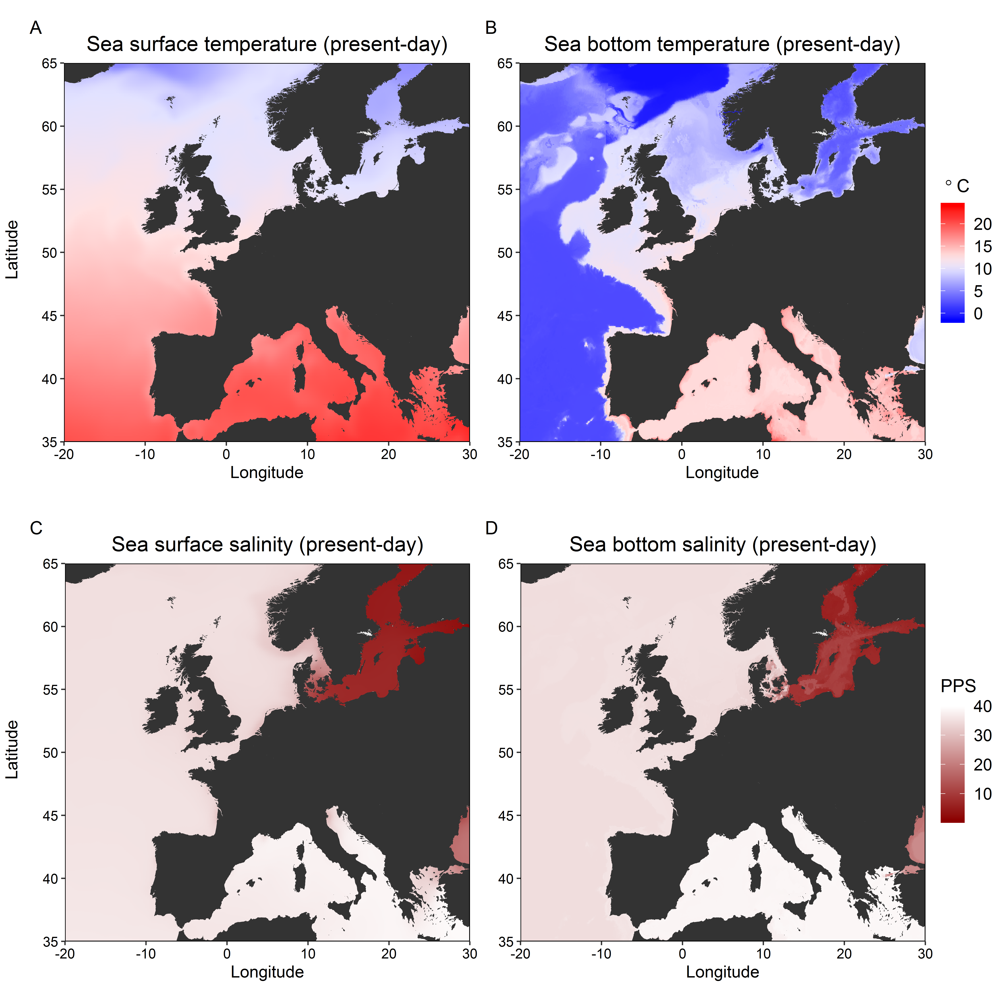
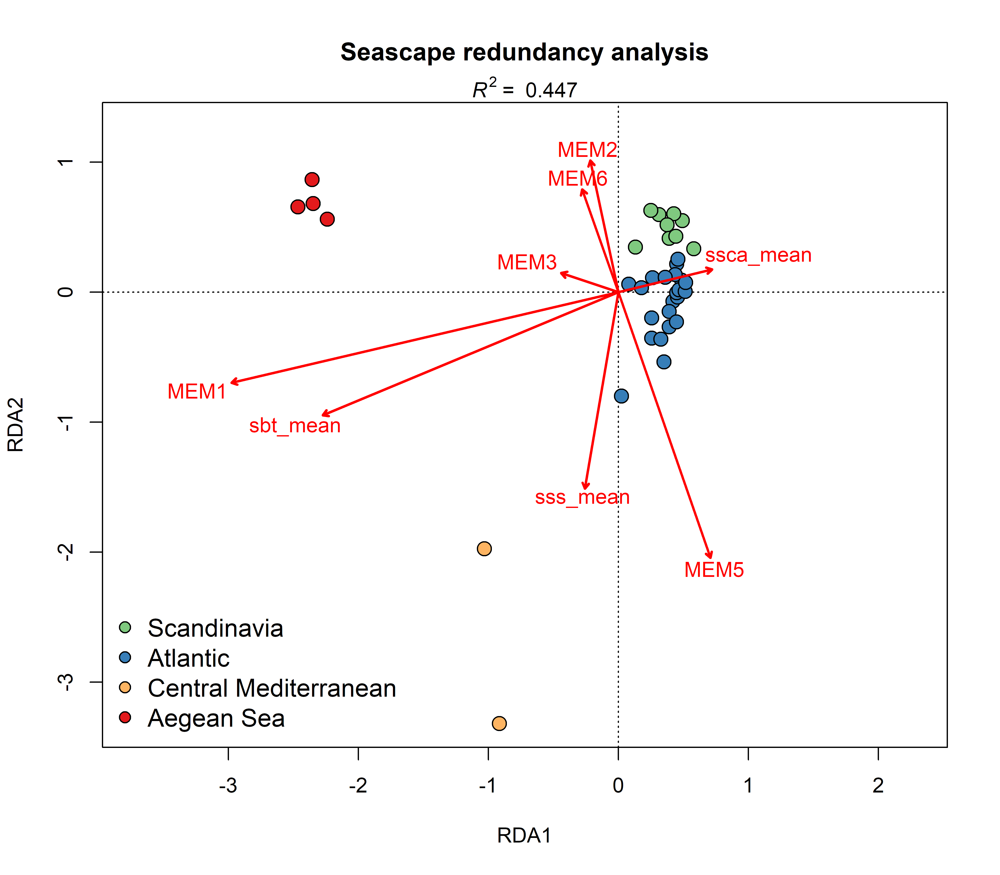

# Redundancy analysis in a seascape genetics framework
The scripts in this repository cover how to conduct a redundancy analysis (RDA) using environmental and spatial data as explanatory (independent) variables and allele frequencies as response (dependent) variables. 

The tutorial has been put together such that you can clone this repository and run the scripts on your own computer.  There are currently four folders of R scripts and data files that cover the following steps:
1. Prepare genetic data
2. Prepare environmental data
3. Prepare spatial data
4. Perform redundancy analysis

### Disclaimer
This tutorial uses biallelic SNP genotypes from a population genetics study on European lobster (_Homarus gammarus_) published in Evolutionary Applications ([Jenkins et al. 2019](https://doi.org/10.1111/eva.12849)). Although the data required to run the R scripts in this repository are provided, the raw data from this study are freely available at the [Dryad Digital Repository](https://doi.org/10.5061/dryad.2v1kr38). Please note that the results presented in this tutorial are not published, but they are part of my PhD thesis. In addition, I have made no attempt to interpret or discuss the findings of this redundancy analysis because the purpose of this repository is get people up and running with their own analyses!

### Example plots
Allele frequencies for nine SNP loci. Each bar represents a sampling site and the colours denote the region of origin.  

  

Maps of present-day sea temperature and salinity in the northeast Atlantic and the Mediterranean.  

  

Redundancy analysis biplot.  
  
### Useful links and resources
Segments of code from other sources have been included in this tutorial. Below are several links to some fantastic resources that provide further information for performing and interpreting redundancy analyses.  
https://popgen.nescent.org/2018-03-27_RDA_GEA.html  
http://www.randigriffin.com/2017/05/23/mosquito-community-ecology-in-vegan.html  
https://mb3is.megx.net/gustame/constrained-analyses/rda  
https://cran.r-project.org/web/packages/adespatial/vignettes/tutorial.html  
https://cran.r-project.org/web/packages/vegan/vignettes/intro-vegan.pdf
